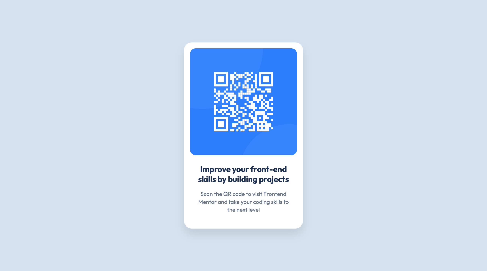

# Frontend Mentor - QR code component solution

This is a solution to the [QR code component challenge on Frontend Mentor](https://www.frontendmentor.io/challenges/qr-code-component-iux_sIO_H). Frontend Mentor challenges help you improve your coding skills by building realistic projects.

## Overview

### Screenshot

### Links

- Solution URL: [https://www.frontendmentor.io/solutions/qr-code-component-trgqN_gF-2](https://www.frontendmentor.io/solutions/qr-code-component-trgqN_gF-2)
- Live Site URL: [https://mschichuang.github.io/QR-code-component/](https://mschichuang.github.io/QR-code-component/)
